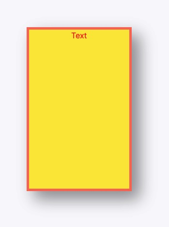
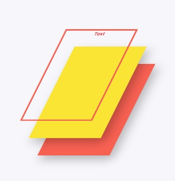
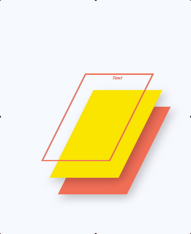

# All About `<text />`

> !! This document is a work in progress !!

Don't be fooled by how simple text seems. It is actually very complicated, which is why browsers and other renderers (e.g. Flutter) have a dedicated text renderer. Why? Well, it has to handle shapes (characters), layout (bounding region), and behavior (text wrapping, position, etc). No easy task.

Instead of thinking about just the characters on the screen, think of `text` as something more like its own layer. Here's a visual to help:

Text layer visual came from modifying https://polypane.app/css-3d-transform-examples/
