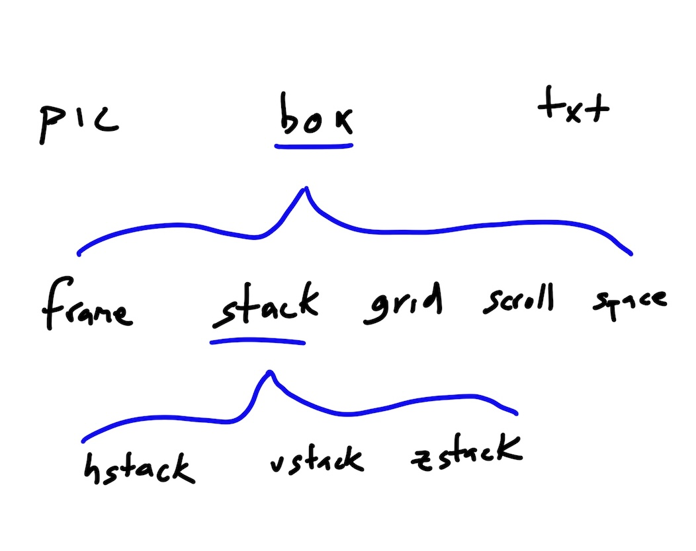

# Definitions and Terms

> !! This document is a work in progress !!

---

Frame, ScrollFrame versus Box, ScrollView

Frame, HStack, VStack, ZStack, ScrollFrame

box => frame, hstack, vstack, zstack, scrollarea/scrollable/scrollframe

stack (with an `axis` prop), grid

---

`<box />` is a **surface**, not a layout component

- cardboard would be paintable surface w/o child.
- could also picture a box wrapping only one child.

Maybe rename `box` to `wrapper`? It may wrap 1 or 0 things, and is often used for decorative reasons...

Update: `box` is now the root layout component. `frame` is more like what I was referring to above.

---

---
