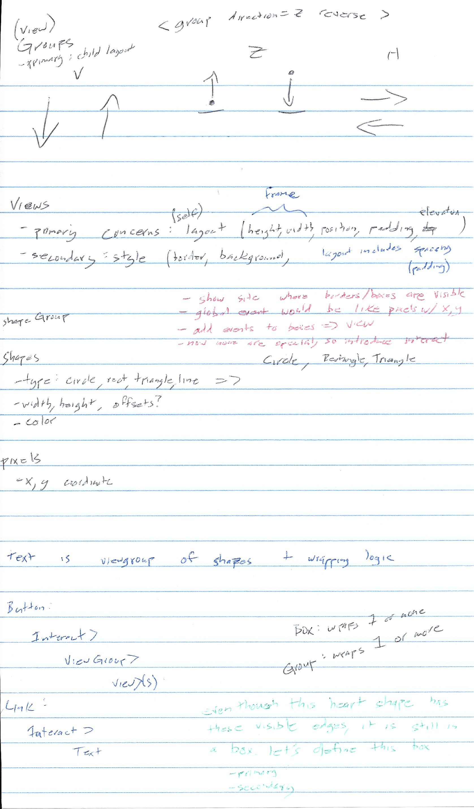
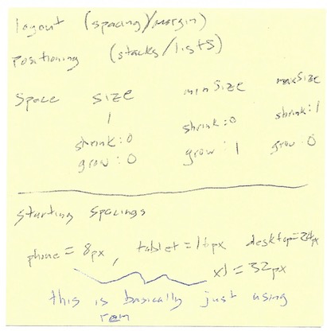

# Definitions and Terms

[WIP]

`<box />` is a **surface**, not a layout component
- cardboard would be paintable surface w/o child.
- could also picture a box wrapping only one child.

Maybe rename `box` to `wrapper`? It may wrap 1 or 0 things, and is often used for decorative reasons...

