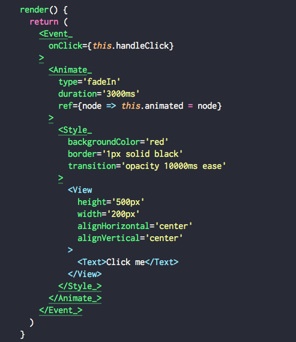
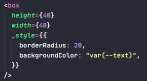

# Injectors

> !! This document is a work in progress !!

See [react\-playbook/Injector\-Component\.md at master · kylpo/react\-playbook](https://github.com/kylpo/react-playbook/blob/master/patterns/Injector-Component.md)

These primitives act a bit like namespaces for their given domain. These could live directly in the primitive with a property key as its namespace, and object as its associated values, but I prefer this nested approach (over the flat) because it shows priority and clear conflict resolution. Also makes it easy to think about the component's organization.

Well, maybe I'm wrong. Below doesn't seem so bad. Could also benefit from enhanced syntax highlighting and fold to highlight/hide certain attributes of a component.

Though I do think `interact_` still has its uses here. Making something interactive is important, and should not be hidden away in the props of the primitive.

---

Think of these injectors as the right side of a GUI builder. The default set of props for the primitive is the default tab on the right, but there is a `style`, `animate`, and `event` tab, too.

Note that this way of thinking/building may work well if/when we all use visuals tools more than code in the near future (link to blog post).

## `style_`

`<style_ />` will pass in a `classname` to its direct child. Therefore, it works on any component that accepts `classname`.

- Could also pass in dynamic styles(?)

## `animate_`

TBD

## `interact_`

TBD
