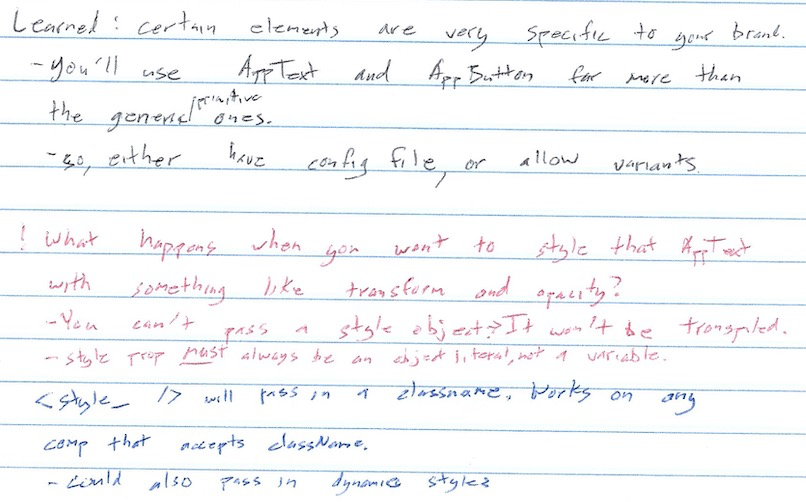
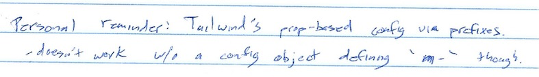
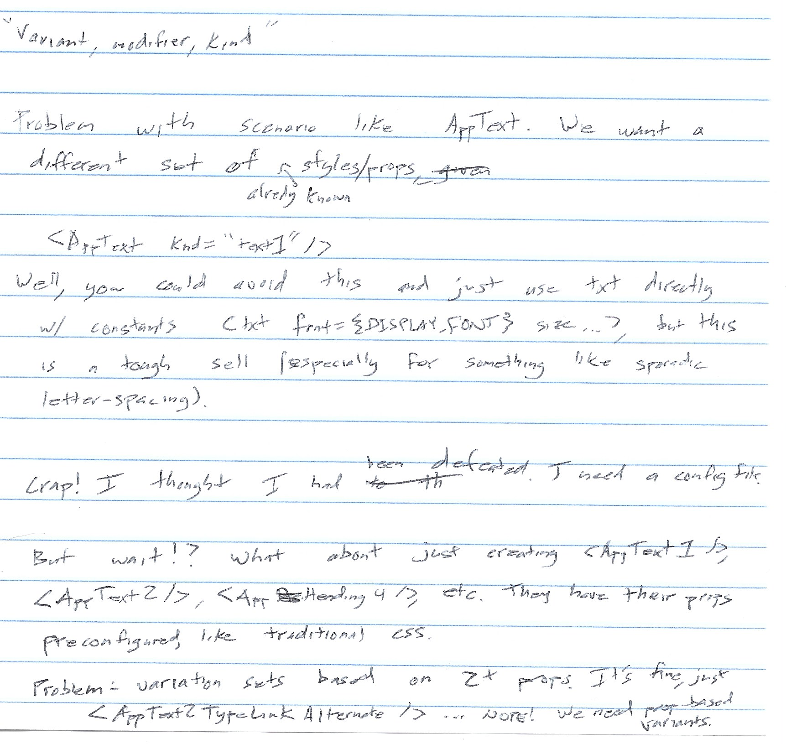

# Variants, Config, and Kind

[WIP]

Two primary uses of primitives: 1) interspersed throughout a composite component (div). 2) abstracted by another component and used as primitive instead (AppText).







---

[Pedro Duarte — Why I Build Design Systems with Stitches and Radix](https://ped.ro/blog/why-i-build-design-systems-with-stitches-and-radix)

```ts
// stitches.config.ts
import { createCss } from "@stitches/react"

export const { styled } = createCss({
  theme: {
    colors: {
      black: "rgba(19, 19, 21, 1)",
      white: "rgba(255, 255, 255, 1)",
      gray: "rgba(128, 128, 128, 1)",
      blue: "rgba(3, 136, 252, 1)",
      red: "rgba(249, 16, 74, 1)",
      yellow: "rgba(255, 221, 0, 1)",
      pink: "rgba(232, 141, 163, 1)",
      turq: "rgba(0, 245, 196, 1)",
      orange: "rgba(255, 135, 31, 1)",
    },
    fonts: {
      sans: "Inter, sans-serif",
    },
    fontSizes: {
      1: "12px",
      2: "14px",
      3: "16px",
      4: "20px",
      5: "24px",
      6: "32px",
    },
    space: {
      1: "4px",
      2: "8px",
      3: "16px",
      4: "32px",
      5: "64px",
      6: "128px",
    },
    sizes: {
      1: "4px",
      2: "8px",
      3: "16px",
      4: "32px",
      5: "64px",
      6: "128px",
    },
    radii: {
      1: "2px",
      2: "4px",
      3: "8px",
      round: "9999px",
    },
    fontWeights: {},
    lineHeights: {},
    letterSpacings: {},
    borderWidths: {},
    borderStyles: {},
    shadows: {},
    zIndices: {},
    transitions: {},
  },
})
```

```ts
{
  backgroundColor: '$turq', // maps to theme.colors.turq
  color: '$black', // maps to theme.colors.turq
  fontSize: '$5', // maps to theme.fontSizes.5
  padding: '$4', // maps to theme.space.4
  borderRadius: '$3' // maps to theme.radii.3
}
```

---

[vanilla-extract/packages/sprinkles at master · seek-oss/vanilla-extract](https://github.com/seek-oss/vanilla-extract/tree/master/packages/sprinkles)

```ts
// styles.css.ts
export const className = atoms({
  display: "flex",
  paddingX: "small",
  flexDirection: {
    mobile: "column",
    desktop: "row",
  },
  background: {
    lightMode: "blue50",
    darkMode: "gray700",
  },
})
```

```ts
// atoms.css.ts
import { createAtomicStyles, createAtomsFn } from "@vanilla-extract/sprinkles"

const space = {
  0: "0",
  4: "4px",
  8: "8px",
  12: "12px",
  // etc.
}

const responsiveStyles = createAtomicStyles({
  conditions: {
    mobile: {},
    tablet: { "@media": "screen and (min-width: 768px)" },
    desktop: { "@media": "screen and (min-width: 1024px)" },
  },
  defaultCondition: "mobile",
  properties: {
    display: ["none", "flex", "block", "inline"],
    flexDirection: ["row", "column"],
    justifyContent: [
      "stretch",
      "flex-start",
      "center",
      "flex-end",
      "space-around",
      "space-between",
    ],
    alignItems: ["stretch", "flex-start", "center", "flex-end"],
    paddingTop: space,
    paddingBottom: space,
    paddingLeft: space,
    paddingRight: space,
    // etc.
  },
  shorthands: {
    padding: ["paddingTop", "paddingBottom", "paddingLeft", "paddingRight"],
    paddingX: ["paddingLeft", "paddingRight"],
    paddingY: ["paddingTop", "paddingBottom"],
    placeItems: ["justifyContent", "alignItems"],
  },
})

const colors = {
  "blue-50": "#eff6ff",
  "blue-100": "#dbeafe",
  "blue-200": "#bfdbfe",
  // etc.
}

const colorStyles = createAtomicStyles({
  conditions: {
    lightMode: {},
    darkMode: { "@media": "(prefers-color-scheme: dark)" },
  },
  defaultCondition: "lightMode",
  properties: {
    color: colors,
    background: colors,
    // etc.
  },
})

export const atoms = createAtomsFn(responsiveStyles, colorStyles)
```
